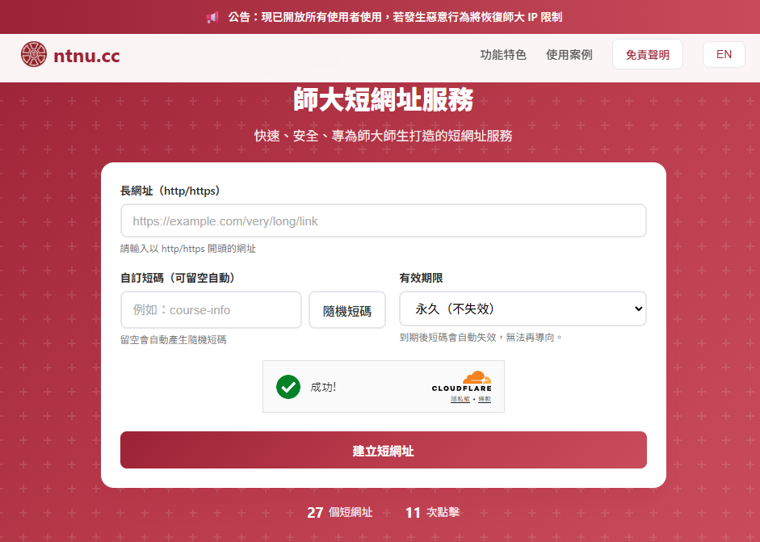

<div align="center">

# 🔗 ntnu.cc **師大短網址服務**

[](https://ntnu.cc) [](https://pages.cloudflare.com/) [](LICENSE)

**基於 Cloudflare Pages Functions 與 KV 的安全短網址服務**



</div>


## 功能特色

- 🚀 **快速轉址**：使用 Cloudflare 全球 CDN，延遲 < 50ms
- 🔒 **安全防護**：CAPTCHA 驗證、IP 白名單、速率限制
- 📊 **統計分析**：點擊追蹤、來源國家統計
- 🔔 **即時通知**：Discord Webhook 整合
- 🛡️ **惡意防護**：網域黑名單、SSRF 防護

## 快速開始

### 1. 環境準備

```bash
# 安裝相依套件
npm install

# 複製環境變數範本
cp .dev.vars.example .dev.vars
```

### 2. 設定環境變數

編輯 `.dev.vars` 填入：

```
ADMIN_API_KEY=your-super-secret-api-key-at-least-32-chars
TURNSTILE_SITE_KEY=your-turnstile-site-key
TURNSTILE_SECRET=your-turnstile-secret-key
DISCORD_WEBHOOK_URL=https://discord.com/api/webhooks/xxx/yyy
ALLOWED_CIDRS=140.122.0.0/16
```

### 3. 建立 KV Namespace

```bash
# 建立 KV Namespace
wrangler kv:namespace create LINKS_KV

# 記下回傳的 id，更新 wrangler.toml
```

### 4. 本地開發

```bash
npm run dev
```

### 5. 部署

```bash
npm run deploy
```

## API 文件

### 建立短網址

```bash
POST /api/create
Authorization: Bearer <ADMIN_API_KEY>
Content-Type: application/json

{
  "url": "https://example.com/very-long-url",
  "id": "custom-id"  // 選填
}
```

回應：
```json
{
  "id": "abc123",
  "shortUrl": "https://ntnu.cc/abc123",
  "targetUrl": "https://example.com/very-long-url"
}
```

### 查詢統計

```bash
GET /api/stats/{id}
Authorization: Bearer <ADMIN_API_KEY>
```

### 列出所有短網址

```bash
GET /api/list?limit=100&cursor=xxx&search=keyword
Authorization: Bearer <ADMIN_API_KEY>
```

### 批量刪除

```bash
DELETE /api/links
Authorization: Bearer <ADMIN_API_KEY>
Content-Type: application/json

{
  "ids": ["abc123", "xyz789"]
}
```

### 健康檢查

```bash
GET /api/health
```

### 公開統計（快照）

```bash
GET /api/public-stats
```

回傳聚合快照（10 分鐘更新一次，stale-while-revalidate），不論資料量大小讀取成本皆為 O(1)。

### 濫用通報

```bash
POST /api/report
Content-Type: application/json

{ "id": "abc123", "category": "phishing", "detail": "補充說明（選填）" }
```

分類：`phishing` / `malware` / `copyright` / `inappropriate` / `privacy` / `other`。
不需認證；每 IP 每 10 分鐘限 5 次；不儲存通報者 IP，僅記錄來源國別。

## 公開頁面

| 路徑 | 說明 |
|------|------|
| `/transparency` | 平台透明度頁：使用現況、每日點擊趨勢、使用者來源、通報處理統計 |
| `/report` | 通報不當連結表單（轉址預覽頁亦有入口） |

## 統計聚合架構

為避免資料量成長後統計讀取 O(N) 掃描（list 全部 key 再逐筆 get），統計改為三層：

1. **每日聚合** `agg:day:<date>`：每次點擊/建立時累加 `{clicks, created, byCountry}`（保留約 400 天）
2. **快照** `agg:snapshot:v1`：由 link metadata（單次 list 即含點擊鏡射）+ 每日聚合彙總而成；
   10 分鐘內直接回傳，過期後回舊資料並背景重算（stale-while-revalidate + lock）
3. **歷史基線** `agg:baseline:v1`：管理員於分析儀表板手動觸發「重建歷史基線」，
   分批全掃描既有 `stats:` 資料，補齊部署聚合功能**之前**的國家/日期分布，
   並回填 link metadata 的點擊鏡射以校正總點擊數

> 部署本功能後，建議到 `/admin/analytics` 執行一次「重建歷史基線」。

## 目錄結構

```
ntnu.cc/
├── functions/               # Cloudflare Pages Functions
│   ├── [id].js             # 短碼轉址處理，根據短碼進行 URL 轉址
│   ├── _middleware.js      # 全域中間件，處理通用邏輯如驗證
│   ├── api/
│   │   ├── create.js       # 建立短網址 API，處理短碼生成邏輯
│   │   ├── health.js       # 健康檢查 API，確認服務狀態
│   │   ├── links.js        # 批量操作 API，支持批量刪除或更新短碼
│   │   ├── list.js         # 列出短網址 API，支持搜尋和分頁
│   │   ├── public-stats.js # 公開統計 API（讀取聚合快照）
│   │   ├── report.js       # 濫用通報 API（公開）
│   │   └── stats/
│   │       └── [id].js     # 統計查詢 API，返回短碼的點擊統計
│   ├── admin/
│   │   ├── index.js        # 管理後台，提供管理員介面
│   │   ├── analytics.js    # 分析儀表板（快照統計 + 每日趨勢 + 維運操作）
│   │   └── reports.js      # 通報管理（審核 / 下架 / 恢復連結）
│   ├── transparency.js     # 平台透明度頁（公開）
│   ├── report.js           # 通報表單頁（公開）
│   └── lib/
│       ├── utils.js        # 工具函數，包含通用邏輯如編碼處理
│       ├── validation.js   # 驗證模組，處理輸入驗證邏輯
│       ├── security.js     # 安全模組，提供防護措施如速率限制
│       ├── aggregate.js    # 統計聚合（每日計數 / 快照 / 歷史基線）
│       ├── reports.js      # 通報資料模組（建立 / 列表 / 狀態）
│       ├── charts.js       # 伺服器端輕量圖表（SVG / CSS bars）
│       ├── auth.js         # 管理員驗證共用（API Key / Session）
│       ├── discord.js      # Discord 通知模組，整合 Webhook
│       └── templates.js    # HTML 模板，生成動態頁面
├── public/                  # 靜態檔案
│   ├── index.html          # 首頁，提供使用者介面
│   ├── 404.html            # 404 頁面，處理未找到的短碼
│   ├── robots.txt          # 搜尋引擎爬蟲設定
│   └── sitemap.xml         # 網站地圖
├── package.json             # 專案配置檔案，管理依賴和腳本
├── wrangler.toml            # Wrangler 配置檔案，管理 Cloudflare Pages
├── .gitignore               # Git 忽略檔案列表
├── .dev.vars.example        # 開發環境變數範本
├── SPEC.md                  # 專案規格文件
└── README.md                # 專案說明文件
```

## 安全設定

### API Key 要求
 
- 長度至少 32 字元
- 包含大小寫字母、數字、特殊符號
- 建議使用 `openssl rand -base64 48` 生成
- 僅透過 `Authorization: Bearer <key>` 傳送

### 速率限制

| 端點 | 限制 | 時間窗口 |
|------|------|----------|
| POST /api/create | 10 次 | 每分鐘 |
| GET /{id} | 60 次 | 每分鐘 |
| POST /{id} | 20 次 | 每分鐘 |
| 管理員登入失敗 | 5 次 | 每 15 分鐘後鎖定 |

### IP 白名單

設定 `ALLOWED_CIDRS` 環境變數限制存取範圍，例如：

```
ALLOWED_CIDRS=140.122.0.0/16,2001:288:5400::/48
```

## Cloudflare Dashboard 設定

### 1. 建立 KV Namespace

1. 前往 Workers & Pages → KV
2. 建立 Namespace，名稱建議 `ntnu-cc-links`
3. 記下 Namespace ID

### 2. 綁定 KV 至 Pages

1. 前往 Pages 專案 → Settings → Functions
2. KV namespace bindings → Add binding
3. Variable name: `LINKS_KV`
4. KV namespace: 選擇剛建立的 namespace

### 3. 設定環境變數

在 Pages → Settings → Environment variables 設定：

**Production 加密變數：**
- `ADMIN_API_KEY`
- `TURNSTILE_SECRET`
- `DISCORD_WEBHOOK_URL`

**Production 一般變數：**
- `TURNSTILE_SITE_KEY`
- `ALLOWED_CIDRS`
- `BLOCKED_DOMAINS`

### 4. 設定 Turnstile

1. 前往 Turnstile
2. 新增 Site，輸入域名 `ntnu.cc`
3. 取得 Site Key 和 Secret Key